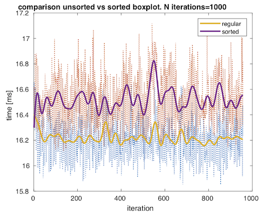
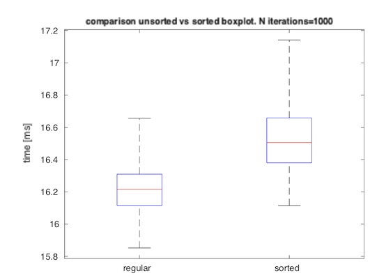

# cvyamlParser
A simple yaml parser for OpenCV datatypes to Matlab using the new Matlab C++ Data API.
The mexfile readcvYaml can be used to transfer data efficiently from OpenCV to Matlab though yaml files. The parser is able to infer the correct datatype at runtime and return it in a corresponding Matlab structure. It uses the OpenCV filestorage class and was tested both in 3.4 as 4.0. Additionally the parser is able to fold indexed variables with same basename into a multidimentional structure. 

## Installation 

### 1: go to mex folder

```bash
cd mex/
```

### 2: invoke mex command with optimization flags:

It's not necessary but good to have level 3 optimisation. by default optimisation level 2 is used. 
 Make sure to link with the correct open cv library and include paths:

```bash
mex -v COPTIMFLAGS="-O3 -fwrapv -DNDEBUG" ../src/readcvYaml.cpp -I [path_to_includes] -L [path_to_lib]
```
e.g.:

```bash
mex -v COPTIMFLAGS="-O3 -fwrapv -DNDEBUG" ../src/readcvYaml.cpp -I/usr/local/include/opencv4 -L/usr/local/lib/ -lopencv_core
```
If mex was successful a verbose message will be printed in the console.
	
### 3: add mex path to matlab path variable:

You do this the easiest by navigating to mex folder and calling:

```Matlab
addpath(pwd); savepath;
```
From now the readcvYaml mex function should be accessible from any path in you matlab environment

### 4: Licence 
Please refer to the licence file for information about code distribution, usage and copy rights. The code is provided under BSD 3-Clause License. 
Refer to the links below for additional licence info regarding OpenCV and Matlab:
https://opencv.org/license/
https://in.mathworks.com/pricing-licensing.html

## Usage
call readcvYaml on the dataset of choice. The function takes as input the filename and the sort option. By default readcvYaml will parse the variables names listed in the yaml file and assign this to a structure with corresponding fields. E.g.:

```Matlab
s = readcvYaml('../data/test_data.yaml')
s = 
  struct with fields:

       matA0: [1000×3 double]
       matA1: [1000×3 double]
       matA2: [1000×3 double]
```
In readcvYaml a handy option is implemented to sort the data based on basename and numeric identifier. When using the sorting option entries that have a unique basename will be folded into multidimentional struct. This is very handy when you have similar datasets that belong to the same category or experimental condition etc. This is done like so:
```Matlab
s = readcvYaml('../data/test_data.yaml','sorted')
s = 
  struct with fields:

        matA: [1×3 struct]
```
The sorting then stores the matrices with matA basename in 2d strructure that can be accessed with:
```Matlab
s.matA(1).matA
```
The numerical identifier does not have to be continuous, the sorting wil sort and store in ascending order. I.e.: A1, A2, A7, A12 and so forth. s.matA(1).index stores the numerical identifier.

The parser will automatically identify the datatype of the stored variable and return this in the structure. It is able to handle all common types used in OpenCV and Matlab environments. Common datatypes are that are returned from OpenCv to matlab: 

```C++
OpenCV 		--> 	Matlab  	--	sizeof 
CV_8U ,CV_8US 	-->	int8_t(char)	--	1
CV_16S,CV_16U	-->	short		--	2
CV_32S		-->	int		--	4
CV_32F		-->	float		--	4
CV_64F		-->	double		--	8
```
The parser can convert vectors, matrices and single variables stored in yaml file. Although untested it should also work with xml files.
Refer to the test_data.yaml and genyamlData.cpp see an example of how the data is generated.

## Benchmarking
 A benchmark results are provided for linux and osx platforms in folders linux and osx. The benchmark test were perfomed on standard Dell Optiplex 7400 and 2,3 GHz Intel Core i5 16G macbook, respectively. 

 To run the benchmark follow the steps:

### 1: generate test data to test the function:

Go to src folder and compile genyamlData:

```bash
cd src/
g++ -std=c++11 genyamlData.cpp -o genyamlData -I [path_to_cv_includes] [opencv_core_lib]
```
e.g.: 

```bash
g++ -std=c++11 genyamlData.cpp -o genyamlData -I /usr/local/include/opencv4 -lopencv_core
```
Then run with: 

```bash
genyamlData [outout_path_of_yaml] 
```
e.g.: 

```bash
genyamlData ../data/test_data.yaml
```

### 2: Run benchmark on you own pc:
In folder benchmark a simple script is provided to run readcvYaml on your own data.
Simply choose the number of iterations with N parameter and run benchmarktest_cvYaml.m. The benchmark was performed for 5x[1000x3] double, 5x[2000x3] float, 5x[2000x3] int, and 5x[3000] double, 5x[6000] float and 5x[6000] int vectors. See test_data.yaml for the actual dataset.

Here the result of the benchmark test on linux Optiplex system. The sorting is slightly more expensive as expected but negligible for the current dataset.

Average t per iteration    |  Boxplot data
:-------------------------:|:-------------------------:
    |  


